# Competitive Brand Research: Top 5 Horse Racing Prediction Services

## Research Completed

I've conducted deep-dive brand analyses on five leading services in the horse racing prediction/betting space:

1. **Timeform** - Heritage authority (founded 1948)
2. **Racing Post** - Industry-leading publication
3. **Smart Betting Club** - Independent tipster review service
4. **Premium Racing Tips** - Modern professional tipster service
5. **BetHunter.io (BetOven)** - AI-powered automated betting software

All analyses are saved in your workspace as detailed markdown files.

---

## Key Findings: Brand Positioning Spectrum

### Market Segmentation

The five services occupy distinct positions in the market:

**Positioning Summary:**

- **Timeform & Racing Post**: Established data authorities, industry standard
- **Smart Betting Club**: Independent watchdog/educator
- **Premium Racing Tips**: Professional tipster service
- **BetHunter**: Technology/automation play

---

## Visual Identity Analysis

### Color Palettes

**Common Themes Across All Five:**

- **Navy/Dark Blue** = Trust, authority, professionalism (used by ALL five)
- **White backgrounds** = Clean, modern
- **Gold/Yellow accents** = Success, winners, premium positioning
- **Green** = Profit indicators
- **Red** = Urgent CTAs, losses

**Brand-Specific Approaches:**

| Brand                   | Primary Colors                 | Accent Colors            | Overall Feel           |
| ----------------------- | ------------------------------ | ------------------------ | ---------------------- |
| **Timeform**            | Deep navy, white, black        | Yellow/gold, green, red  | Professional heritage  |
| **Racing Post**         | Red/burgundy, dark navy, white | Yellow/gold, green, blue | Media authority        |
| **Smart Betting Club**  | Professional blues             | Data-driven neutrals     | Consumer protection    |
| **Premium Racing Tips** | Navy, white, black             | Gold, green              | Finance-inspired trust |
| **BetHunter**           | Dark navy/charcoal, white      | Bright tech accents      | Modern SaaS aesthetic  |

**Key Takeaway**: Navy blue + white + gold is the industry standard for trust and professionalism in racing/betting services.

---

## Typography & Logo Styles

**Consistent Patterns:**

1. **Sans-serif dominance** - All five use clean, modern sans-serif fonts
2. **Bold headlines** - Authority and confidence
3. **Wordmark logos** - Text-based rather than complex graphics
4. **Data-optimized** - High readability for dense information displays

**Differentiation:**

- **Timeform & Racing Post**: Traditional media heritage, professional
- **BetHunter**: Tech/software company aesthetic
- **Others**: Modern digital-first branding

---

## Positioning Strategies: Direct Comparison

### Taglines & Value Propositions

| Brand                   | Primary Tagline                                      | Core Promise                                               |
| ----------------------- | ---------------------------------------------------- | ---------------------------------------------------------- |
| **Timeform**            | "Bet Better"                                         | Access to 78-year-old industry-standard ratings            |
| **Racing Post**         | "The definitive source for horse racing information" | Comprehensive data + insider access                        |
| **Smart Betting Club**  | "The Tipster Experts: 100% Independent Reviews"      | Consumer protection through independence                   |
| **Premium Racing Tips** | "Leading Expert Horse Racing Tips & Picks Service"   | Verified long-term profitability (40/48 profitable months) |
| **BetHunter**           | "100% Automatic arbitrage betting software"          | AI-powered automation (no manual betting)                  |

### Differentiation Strategies

**Timeform**: Heritage + Industry Authority

- 78 years in business (since 1948)
- Ratings used by professionals
- Mathematical/systematic approach
- "Play smarter" intelligence advantage

**Racing Post**: Comprehensive Data + Media Authority

- Definitive industry publication
- Insider access (stable tours, trainer interviews)
- Multi-revenue model (subscriptions + affiliates + advertising)
- Daily fresh content

**Smart Betting Club**: Independence + Consumer Advocacy

- 100% independent (no affiliate deals)
- Member-funded business model
- 19+ year track record
- "Fiercely protective of ordinary punters"

**Premium Racing Tips**: Transparency + Track Record

- Third-party verified results
- £13,986 profit since 2022 launch
- Quality over quantity (1-2 tips daily)
- Selective, professional approach

**BetHunter**: Automation + Technology

- Only service that places bets automatically
- AI-powered betting bot
- Arbitrage (mathematical certainty)
- "Earn money while you sleep"

---

## CTAs & Conversion Strategy

### Primary Call-to-Action Patterns

**Subscription-Focused (Timeform, Racing Post, Smart Betting Club, Premium Racing Tips):**

- "Join Today" / "Subscribe" / "Join NOW"
- Direct, imperative language
- Value emphasis ("only £5", "less than £1/day")
- Urgency indicators ("today", "now")

**Trial-Focused (BetHunter):**

- "Try for Free" / "Prueba gratis"
- Gift framing ("🎁 Get £25 credit")
- Low-pressure, benefit-driven
- Product demonstration over reputation

### CTA Language Comparison

| Brand                   | Primary CTA               | Secondary CTA                       | Tone                    |
| ----------------------- | ------------------------- | ----------------------------------- | ----------------------- |
| **Timeform**            | "Join Race Passes today!" | "View today's Race Cards - only £5" | Professional, confident |
| **Racing Post**         | "Subscribe" + "Free Bets" | "CLAIM OFFER"                       | Urgent, value-focused   |
| **Smart Betting Club**  | "Join NOW"                | "Free Membership"                   | Urgent but professional |
| **Premium Racing Tips** | "Join Today" + "Buy Now"  | "See Testimonials"                  | Direct, proof-oriented  |
| **BetHunter**           | "Try for Free"            | "Enter the Channel" (Telegram)      | Low-risk, tech-focused  |

**Key Insight**: Traditional services use urgency + value, while tech services use trial + demonstration.

---

## Overall Brand Vibe Analysis

### Professional vs. Casual Scale (0-10, where 10 = Most Professional)

| Brand                   | Score | Description                                               |
| ----------------------- | ----- | --------------------------------------------------------- |
| **Timeform**            | 8/10  | 80% Professional, 20% Accessible - Expert-driven, serious |
| **Racing Post**         | 8/10  | Professional but data-dense, betting-forward              |
| **Smart Betting Club**  | 7/10  | Professional with accessible expertise                    |
| **Premium Racing Tips** | 8/10  | Expert consultant, not gambling buddy                     |
| **BetHunter**           | 9/10  | Software company, not gambling service                    |

### Traditional vs. Modern Scale (0-10, where 10 = Most Modern)

| Brand                   | Score  | Description                                       |
| ----------------------- | ------ | ------------------------------------------------- |
| **Timeform**            | 3/10   | 70% Traditional, 30% Modern - Heritage emphasized |
| **Racing Post**         | 4/10   | Hybrid - Print legacy with digital embrace        |
| **Smart Betting Club**  | 4/10   | Traditional authority + modern transparency       |
| **Premium Racing Tips** | 4/10   | 60% Traditional racing, 40% Modern (Telegram)     |
| **BetHunter**           | 9.5/10 | 95% Modern - Cutting-edge AI/automation           |

### Data-Driven vs. Emotional Scale (0-10, where 10 = Most Data-Driven)

| Brand                   | Score  | Description                                      |
| ----------------------- | ------ | ------------------------------------------------ |
| **Timeform**            | 9/10   | Mathematical ratings at core, minimal emotion    |
| **Racing Post**         | 9/10   | Information-dense, professional analysis         |
| **Smart Betting Club**  | 8/10   | Heavy data with transformation testimonials      |
| **Premium Racing Tips** | 7/10   | Statistics-driven with winner stories            |
| **BetHunter**           | 8.5/10 | Algorithm emphasis with "while you sleep" dreams |

---

## Pricing & Monetization Strategies

### Pricing Model Comparison

| Brand                   | Model                   | Entry Price  | Premium Price                | Strategy                   |
| ----------------------- | ----------------------- | ------------ | ---------------------------- | -------------------------- |
| **Timeform**            | Tiered subscription     | £10 (1 day)  | £30/month                    | Progressive engagement     |
| **Racing Post**         | Freemium + affiliates   | Free tier    | Racing Post+ (35% off promo) | Multi-revenue streams      |
| **Smart Betting Club**  | Pure subscription       | £24.99/month | £139.99/year (53% savings)   | Member-funded independence |
| **Premium Racing Tips** | Subscription tiers      | £49.99/month | £449.99/year (25% discount)  | Premium positioning        |
| **BetHunter**           | Points-based investment | £100 minimum | £2,400+                      | Investment framing         |

### Revenue Stream Breakdown

**Timeform:**

- Race Passes subscriptions (primary)
- PDF Race Cards (£5 per meeting)
- B2B API (£500+/month)
- Affiliate bookmaker partnerships

**Racing Post:**

- Racing Post+ subscriptions
- Betting affiliates (50+ bookmaker partnerships)
- Casino/gaming partnerships
- E-commerce shop
- Display advertising

**Smart Betting Club:**

- Pure subscription revenue (no affiliates)
- Member-funded model
- Tipster discount partnerships (value-add)

**Premium Racing Tips:**

- Subscription tiers (primary)
- Likely bookmaker affiliates (not prominent)
- Telegram bot delivery

**BetHunter:**

- Points purchases (£100-£2,400+)
- Potential bookmaker affiliates
- PRO Academy (currently free, potential upsell)

### Pricing Psychology Insights

**Value Anchoring Techniques:**

- **Timeform**: "Less than £1 per day" (affordability framing)
- **Racing Post**: "£2,500+ in Bonuses" (aggregate bookmaker offers)
- **Smart Betting Club**: Compare to £9,250/year university education
- **Premium Racing Tips**: "£13,986 profit since 2022" vs. £49.99/month
- **BetHunter**: "€5,100,000 total user profits" makes £100 seem tiny

**Key Lesson**: Frame subscription cost against potential returns or alternative education/services.

---

## Social Proof & Trust Strategies

### Trust-Building Approaches

**Heritage & Longevity:**

- **Timeform**: 78 years (founded 1948) - strongest heritage play
- **Racing Post**: Decades of operation (not explicitly stated, but implied)
- **Smart Betting Club**: 19+ years (since 2006)
- **Premium Racing Tips**: Operating since 2022 (shorter, but verified results)
- **BetHunter**: Operating since at least 2021

**Verification Methods:**

| Brand                   | Verification Type                             | Credibility Level |
| ----------------------- | --------------------------------------------- | ----------------- |
| **Timeform**            | Industry adoption (ratings are standard)      | ⭐⭐⭐⭐⭐ Highest     |
| **Racing Post**         | Insider access (trainer tours, interviews)    | ⭐⭐⭐⭐⭐ Authority   |
| **Smart Betting Club**  | Long-term tracking (3+ years to Hall of Fame) | ⭐⭐⭐⭐ Strong       |
| **Premium Racing Tips** | Third-party verification of all results       | ⭐⭐⭐⭐⭐ Excellent   |
| **BetHunter**           | None (€5.1M claim unverified)                 | ⭐⭐ Weakest        |

**Testimonial Strategies:**

- **Timeform**: Industry adoption (not customer testimonials)
- **Racing Post**: Expert columnists, industry insiders
- **Smart Betting Club**: 6 detailed testimonials with specific profit figures, real names
- **Premium Racing Tips**: 6 detailed testimonials with member since dates, profit journeys
- **BetHunter**: 9+ video testimonials (real faces, Spanish-speaking users)

**Key Insight**: Third-party verification is the gold standard. BetHunter's lack of it is a major gap that your horse racing AI should exploit.

---

## Navigation & Content Organization

### Content Prioritization Patterns

**Homepage Hierarchy (First 5 Elements):**

**Timeform:**

1. Today's Racing (immediate, time-sensitive)
2. Race Passes subscription (monetization)
3. Tips & Features (expert content)
4. Results (post-race information)
5. News & Features (editorial)

**Racing Post:**

1. Next Race countdown timer (urgency)
2. Upcoming Racecards (time-sensitive)
3. Latest Results (recently settled)
4. Top Stories (editorial)
5. Racing Post+ Premium Content (upsell)

**Smart Betting Club:**

1. Urgency message (countdown, price increase)
2. Free Membership form (lead capture)
3. Main Membership CTA (conversion)
4. Benefits list (15+ features)
5. Social proof ("As Featured On...")

**Premium Racing Tips:**

1. Value proposition + CTA ("Join Today")
2. Authority statement ("Best Horse Racing Tipster")
3. Proof section (profit figures, verified results)
4. Results display (2022, 2023, Inception)
5. Latest winners (50/1, 66/1 success stories)

**BetHunter:**

1. Automation promise ("100% Automatic")
2. Profit claims (€5.1M user profits)
3. Free trial CTA
4. Pricing table
5. Video testimonials

**Pattern**: All lead with value proposition → proof/results → conversion CTA → social proof

---

## Key Messaging Themes

### Most Repeated Phrases by Brand

**Timeform:**

- "Bet Better" (tagline)
- "Since 1948" (heritage)
- "Professional tools" (authority)
- "Less than £1 per day" (affordability)

**Racing Post:**

- "Definitive source" (authority)
- "£2,500+ in Bonuses" (value)
- "35% off for A WHOLE YEAR" (urgency)
- "Expert columnists" (credibility)

**Smart Betting Club:**

- "100% Independent" (differentiation)
- "Long-term focus" (patience)
- "Real results" (transparency)
- "Fiercely protective" (advocacy)

**Premium Racing Tips:**

- "Best horse racing tipster service" (SEO + positioning)
- "Third-party verification" (trust)
- "Quality over quantity" (selectivity)
- "1-2 tips daily" (restraint)

**BetHunter:**

- "100% Automatic" (core differentiator)
- "AI-powered" (tech credibility)
- "Risk-free" (arbitrage certainty)
- "While you sleep" (passive income dream)

---

## Competitive Advantages Summary

### Timeform's Moat

1. 78-year heritage (impossible to replicate)
2. Industry-standard ratings system
3. B2B relationships with trainers/operators
4. Owned by Flutter Entertainment (resources)

### Racing Post's Moat

1. Comprehensive data access (licensing agreements)
2. Insider relationships (stable access, interviews)
3. Multi-platform presence (print legacy + digital)
4. 50+ bookmaker partnerships (affiliate revenue)

### Smart Betting Club's Moat

1. Member-funded independence (authentic positioning)
2. 19-year archive of reviews
3. 3+ year evaluation periods (rigorous methodology)
4. No conflicts of interest (credibility)

### Premium Racing Tips' Moat

1. Third-party verification (transparency)
2. Long-term track record (40/48 profitable months)
3. Selective approach (quality positioning)
4. Festival expertise (Cheltenham specialization)

### BetHunter's Moat

1. Full automation (unique in market)
2. AI algorithm (proprietary technology)
3. Bookmaker API integrations (technical barrier)
4. First-mover advantage in automation

---

## Opportunities for Your Horse Racing AI

### Gaps in the Market

Based on the five competitors analyzed, here are the key opportunities:

**1. Third-Party Verification + AI:**

- **Gap**: BetHunter lacks verification; traditional tipsters lack AI
- **Opportunity**: Combine AI positioning with third-party verified results
- **Competitive Edge**: Tech credibility + transparency

**2. Accessible Entry Point + Premium Features:**

- **Gap**: BetHunter requires £100+ minimum; tipsters have lower barriers but less automation
- **Opportunity**: £25-50/month entry tier with automation features
- **Competitive Edge**: Lower barrier than BetHunter, higher value than traditional tipsters

**3. Specialist Expertise + Modern Tech:**

- **Gap**: BetHunter is multi-sport generalist; Timeform/Racing Post traditional
- **Opportunity**: Racing specialist with cutting-edge AI/ML
- **Competitive Edge**: Deep domain knowledge + modern technology

**4. Web-Based + Mobile-Friendly:**

- **Gap**: BetHunter requires software installation
- **Opportunity**: Browser-based, mobile-optimized experience
- **Competitive Edge**: Accessibility, no technical barriers

**5. Founder-Led Brand + Personal Story:**

- **Gap**: Most brands are anonymous corporate entities
- **Opportunity**: Personal founder narrative, racing background
- **Competitive Edge**: Human connection, authenticity

**6. Community + Education:**

- **Gap**: Limited interactive community features across all five
- **Opportunity**: Discord/Telegram community + comprehensive racing education
- **Competitive Edge**: Belonging, customer success, retention

**7. Dual-Mode Strategy (Conservative + Aggressive):**

- **Gap**: Most services offer single approach
- **Opportunity**: Multiple risk profiles (like BetHunter's surebets + valuebets)
- **Competitive Edge**: Serve broader audience, user control

**8. Festival Specialization + Year-Round Value:**

- **Gap**: Premium Racing Tips heavy on Cheltenham; others don't specialize
- **Opportunity**: Major festival expertise + consistent daily value
- **Competitive Edge**: Seasonal marketing + ongoing engagement

---

## Brand Strategy Recommendations

### Visual Identity

**What to Match:**

- Navy blue + white + gold color palette (industry standard)
- Clean, professional sans-serif typography
- Data-rich visualizations
- Professional racing photography

**How to Differentiate:**

- More modern, less traditional feel than Timeform/Racing Post
- Tech-forward aesthetic like BetHunter, but warmer/more accessible
- Mobile-first design approach
- AI/ML visualization elements (neural networks, data flows)

### Positioning

**Core Positioning Statement:**

> "For serious horse racing bettors seeking consistent long-term profits, [Your Brand] is the AI-powered prediction service that combines cutting-edge machine learning with third-party verified results - delivering the accuracy of traditional experts with the speed and objectivity of modern technology."

**Differentiation Pillars:**

1. **AI-Powered** (like BetHunter, but racing-specific)
2. **Third-Party Verified** (like Premium Racing Tips)
3. **Racing Specialist** (like Timeform/Racing Post, but AI-driven)
4. **Transparent & Independent** (like Smart Betting Club)
5. **Accessible Technology** (web-based, mobile-friendly)

### Pricing Strategy

**Recommended Tiers:**

| Tier        | Price            | Target                      | Features                                |
| ----------- | ---------------- | --------------------------- | --------------------------------------- |
| **Trial**   | Free (7-14 days) | Curious prospects           | Limited tips, education access          |
| **Starter** | £29.99/month     | Entry-level serious bettors | 1-2 daily tips, results tracking        |
| **Pro**     | £79.99/month     | Committed bettors           | All tips, advanced analytics, community |
| **Elite**   | £149.99/month    | Professional bettors        | Everything + automation, early access   |

**Rationale:**

- Lower than Premium Racing Tips (£49.99) for entry
- Higher tiers for advanced features
- Not as high-barrier as BetHunter (£100+)
- Competitive with Smart Betting Club (£24.99)

### CTAs & Messaging

**Primary CTAs:**

- "Start Free Trial" (low-friction)
- "See Verified Results" (transparency)
- "Join 1,000+ Winning Members" (social proof)

**Key Messages:**

- "AI-Powered Horse Racing Predictions"
- "Third-Party Verified Results"
- "90% Win Rate on [Specific Category]" (if true and verifiable)
- "From Data to Dividends"
- "The Future of Racing Analysis"

### Social Proof Strategy

**Must-Haves:**

1. Third-party verification partner (like Premium Racing Tips)
2. Video testimonials with real members (like BetHunter)
3. Detailed text testimonials with profit journeys (like Smart Betting Club)
4. Named winners at major festivals (like Premium Racing Tips)
5. Industry mentions or media features (like Smart Betting Club)

### Content Strategy

**Educational Content (like Smart Betting Club):**

- Racing fundamentals course
- Bankroll management guides
- Festival preparation content
- AI/ML explainer (how the model works)

**SEO Content (like Premium Racing Tips):**

- "Cheltenham Festival Tips 2026"
- "Grand National Predictions"
- "How to Profit at Royal Ascot"
- "AI vs. Traditional Racing Analysis"

**Community Content:**

- User success stories
- Weekly results recaps
- Live Q&A sessions
- Discord/Telegram engagement

---

## Detailed Files Created

All five comprehensive brand analyses have been saved to your workspace:

1. `timeform-brand-analysis.md` (20 sections, 792 lines)
2. `racing-post-brand-analysis.md` (13 sections, 563 lines)
3. `smart-betting-club-brand-analysis.md` (14 sections, 765 lines)
4. `brand-analysis-premiumracingtips.md` (16 sections, 609 lines)
5. `brand-analysis-bethunter.md` (18 sections, 1,769 lines)

Each file contains:

- Visual identity (colors, typography, imagery)
- Positioning statements and value propositions
- CTAs and conversion language
- Overall brand vibe and personality
- Navigation and content organization
- Pricing and monetization strategies
- Social proof and trust elements
- Competitive differentiation
- Target audience profiles
- Key messaging themes
- Strengths and weaknesses
- Recommendations for competing/complementing

---

## Next Steps for Brand Development

### Immediate Actions

1. **Choose Your Differentiation Angle:**
  - AI + Verification (combine BetHunter's tech with Premium Racing Tips' transparency)
  - Specialist + Accessible (Timeform's expertise with BetHunter's user experience)
  - Independent + Modern (Smart Betting Club's ethics with contemporary tech)
2. **Develop Visual Identity:**
  - Navy + white + gold base (industry standard for trust)
  - Add distinctive accent color (tech-forward but warm)
  - Modern sans-serif typography
  - AI/ML visualization elements
3. **Craft Core Messaging:**
  - Single-sentence value proposition
  - 3-5 key differentiators
  - Proof points (if you have early results, get them verified)
  - Founder story (if applicable)
4. **Set Up Verification:**
  - Partner with third-party results verification service
  - Document all predictions and outcomes
  - Build credibility from day one
5. **Create MVP Content:**
  - Homepage with clear value proposition
  - Results page (even if limited initially)
  - Educational content (racing AI explainer)
  - Pricing page with 2-3 tiers
  - Testimonial structure (even if empty initially, shows commitment)

### Long-Term Strategy

**Month 1-3:**

- Build verification track record
- Create educational content
- Engage in racing communities
- Collect early user testimonials

**Month 4-6:**

- Scale content marketing (SEO)
- Video testimonials
- Festival-focused campaigns
- Community building (Discord/Telegram)

**Month 7-12:**

- Expand pricing tiers
- Add automation features
- Media outreach
- Partnership opportunities

---

## Competitive Positioning Matrix

```mermaid
graph LR
    subgraph priceAxis [Price →]
        lowPrice[Low £10-30/mo]
        midPrice[Mid £50-150/mo]
        highPrice[High £150+/mo]
    end
    
    subgraph techAxis [← Technology Level]
        traditional[Traditional Analysis]
        moderate[Some Tech]
        advanced[AI/Automation]
    end
    
    Timeform -->|£30/mo, Traditional| midPrice
    RacingPost -->|£?, Traditional| midPrice
    SmartBettingClub -->|£25/mo, Traditional| lowPrice
    PremiumRacingTips -->|£50/mo, Traditional| midPrice
    BetHunter -->|£100+, AI/Automation| highPrice
    YourBrand[Your Racing AI] -->|£30-150/mo, AI| midPrice
```

**Your Positioning**: Bridge the gap between traditional tipsters (lower price, proven methods) and automation tech (higher price, cutting-edge). Offer AI-powered accuracy at competitive pricing with transparency.

---

## Final Recommendations Summary

### Do This (Competitive Advantages)

✅ **Third-party verification from day one** (BetHunter's biggest weakness)  
✅ **Web-based, mobile-friendly** (vs. BetHunter's software install)  
✅ **Lower entry barrier** (£25-50/month vs. £100+ upfront)  
✅ **Racing specialist expertise** (vs. BetHunter's multi-sport generalist)  
✅ **Founder-led brand** (vs. anonymous corporate brands)  
✅ **Video + text testimonials** (comprehensive social proof)  
✅ **Regular content updates** (avoid BetHunter's outdated content issue)  
✅ **AI positioning** (modern, credible, differentiating)  
✅ **Risk transparency** (honest about variance, losing bets)  
✅ **Community building** (Discord/Telegram for retention)

### Don't Do This (Common Pitfalls)

❌ **Don't charge £100+ upfront** (too high barrier)  
❌ **Don't lack verification** (transparency is essential)  
❌ **Don't be multi-sport generalist** (specialize in racing)  
❌ **Don't require software installation** (web-based is better)  
❌ **Don't be anonymous** (personal brand builds trust)  
❌ **Don't promise 100% winners** (unrealistic, hurts credibility)  
❌ **Don't ignore education** (teach, don't just sell)  
❌ **Don't skimp on social proof** (testimonials are essential)  
❌ **Don't keyword stuff** (Premium Racing Tips overdoes SEO)  
❌ **Don't neglect community** (retention tool)

---

## Color Palette Recommendations

Based on the competitive analysis, here's a recommended palette that positions you as modern/tech-forward while maintaining racing industry trust:

**Primary Colors:**

- **Navy Blue #1B2845** (trust, authority - industry standard)
- **White #FFFFFF** (clean, professional)
- **Charcoal #2C3E50** (modern, sophisticated)

**Accent Colors:**

- **Electric Blue #3498DB** (tech-forward, AI association)
- **Gold #F39C12** (success, winners, premium)
- **Emerald Green #27AE60** (profit, positive)

**Functional Colors:**

- **Red #E74C3C** (losses, urgent CTAs)
- **Light Gray #ECF0F1** (backgrounds, cards)

This palette:

- Maintains racing industry trust (navy + gold)
- Adds modern tech credibility (electric blue)
- Differentiates from pure traditional (not burgundy/red like Racing Post)
- Professional and sophisticated

---

## Typography Recommendations

**Headlines:**

- Inter Bold or Poppins Bold (modern, tech-forward)
- 40-60px for hero headlines
- 28-36px for section headers

**Body:**

- Inter Regular or Open Sans (high readability)
- 16-18px for body text
- 14-16px for captions

**Data/Numbers:**

- Inter Bold or Roboto Mono (emphasis on statistics)
- Larger size for profit figures, ROI percentages

**Why These Fonts:**

- Inter: Modern, excellent readability, tech-industry standard
- Poppins: Friendly but professional, geometric
- Open Sans: Highly readable, neutral
- All are sans-serif (industry standard for racing/betting services)
